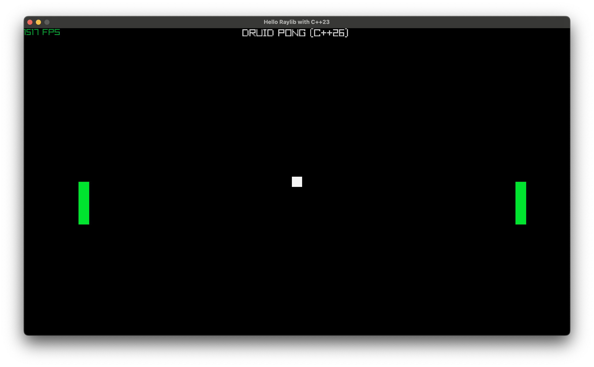

# Druid

<p align="center">
    
</p>

## 2D cross-platform game engine

[Druid](https://druidengine.org) is a 2D game engine written in modern C++ to explore contemporary C++ features and graphics programming techniques. Built with performance and educational value in mind, it demonstrates the use of C++20 modules, cross-platform development, and an opportunity to learn.



## Features

- **Modern C++**: Utilizes C++20 modules and contemporary C++ patterns
- **Cross-Platform**: Supports Windows, Linux, macOS, Android, and WebAssembly
- **Educational Focus**: Designed as a learning platform for modern C++ and graphics programming

## Compiling from source

This project uses CMake with presets for easy configuration and building across different platforms and architectures.

To see all available presets for your platform:
```bash
cmake --list-presets
```

### Prerequisites

- CMake 3.31+, Ninja 1.10+
- g++15+, Clang-20+, MSVC 17.14+
- Git

### Windows

For supported presets review [platform-windows.json](./cmake/preset/platform-windows.json)

#### Using Visual Studio 2022

1. Clone the repository:
   ```powershell
   git clone https://github.com/druidengine/druid
   cd druid
   ```

1. Configure the project using a preset:
   ```powershell
   cmake --preset x64-windows-msvc-debug
   ```

1. Build the project:
   ```powershell
   cmake --build --preset x64-windows-msvc-debug
   ```

1. Run the Pong example:
   ```powershell
   .\build\app\pong\druid-pong.exe
   ```

1. Run unit tests:
   ```powershell
   ctest --preset x64-windows-msvc-debug
   ```

### Linux

For supported presets review [platform-linux.json](./cmake/preset/platform-linux.json)

#### Using GCC

1. Clone the repository:
   ```bash
   git clone https://github.com/druidengine/druid
   cd druid
   ```

1. Install dependencies (Ubuntu/Debian):
   ```bash
   sudo apt install -y curl tar git zip unzip make autoconf libtool ninja-build cmake
   sudo apt install -y libxinerama-dev libxcursor-dev xorg-dev libglu1-mesa-dev pkg-config libgl1-mesa-dev libx11-dev libxrandr-dev
   ```

1. Configure the project:
   ```bash
   cmake --preset x64-linux-gcc-debug
   ```

1. Build the project:
   ```bash
   cmake --build --preset x64-linux-gcc-debug
   ```

1. Run the Pong example:
   ```bash
   ./build/app/pong/druid-pong
   ```

1. Run unit tests:
   ```bash
   ctest --preset x64-linux-gcc-debug
   ```

## Community and contributing

To get started contributing to the project, review the [CONTRIBUTING.md](CONTRIBUTING.md) document.
